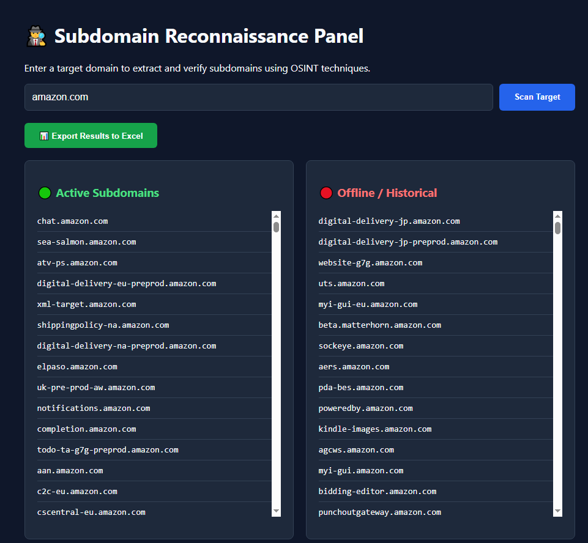

# 🪐 🧠 ⚔️ NATSUO OSINT WEB DOMAIN ⚔️ 🧠 🪐
## 📊 🛡️ AUTOMATED SUBDOMAIN RECONNAISSANCE & ATTACK SURFACE MANAGEMENT 🛡️ 📊

<p align="center">
  
  
  
</p>

---

🕵️‍♂️ **Natsuo OSINT Web Domain** is a high-performance, enterprise-grade
**Passive Reconnaissance** web application designed to completely automate subdomain discovery, asset tracking, and attack surface mapping. 

📜 By leveraging advanced **Certificate Transparency (CT) logs** via distributed external APIs, the core engine uncovers deeply hidden infrastructure and asset structures 
**without sending a single direct packet** to the target network. This guarantees a 100% stealthy, fully covert passive intelligence-gathering routine.

### 💻 Engineered for:
- 🎯 **Bug Bounty Hunters** mapping expansive scopes.
- 🛡️ **Penetration Testers** looking for unindexed subdomains.
- 🚀 **Security Engineers** managing external attack surfaces.

---

## 🚀 Key Features

- **🕵️‍♂️ Passive Subdomain Enumeration:** Extracts extensive subdomain data dynamically by querying public Certificate Transparency engines (`crt.sh` and `CertSpotter`).
- **🔄 Resilient Retry Mechanism:** Built-in exponential backoff/retry layer when interacting with external APIs, handling rate limits and network degradation smoothly.
- **📊 Historical Attack Surface Mapping:** Caches and indexes historical scan results locally, allowing users to query past reconnaissance baselines instantly.
- **🌐 Asynchronous DNS Validation:** Integrated Node.js native DNS resolver module to cross-check live subdomains against passive log data.
- **🗄️ Zero-Configuration Provisioning:** Embedded SQLite service layer that self-initializes and builds its relational schema dynamically upon the first boot.
- **🖥️ Intuitive Web UI & REST API:** Features a responsive user interface for visual analysis alongside an architectural REST API for CLI automated mapping pipelines.

---

## 🛠️ Tech Stack

- **🎨 Frontend:** HTML5, CSS3, Modern Layout Components (fully interactive client dashboard).
- **⚙️ Backend:** Node.js, Express.js (RESTful Architecture).
- **💾 Database:** SQLite (via native `sqlite3` driver).
- **🔍 OSINT Services:** Certificate Transparency Logs (`crt.sh`, `CertSpotter`).
- **🔗 Core Dependencies:** `axios`, `express`, `sqlite3`, `dns`.

---

## 📂 Project Architecture

The application implements a clean, modular structure following Separation of Concerns (SoC) patterns:

```text
natsuo-osint-web-domain/
├── src/
│   ├── config/
│   │   └── (Database setup & initialization)
│   ├── controllers/
│   │   └── scanController.js    # Express route request handler & validation
│   ├── services/
│   │   ├── dbService.js         # SQLite transactional query execution layer
│   │   └── subfinderService.js  # OSINT API fetcher & retry state machine
│   └── app.js                   # Application bootloader & Express engine root
├── package.json
└── README.md
🔧 Installation & Setup

📋 PrerequisitesNode.js (v18.0.0 or higher) installed on your system.

💻 Getting Started📥

Clone this repository to your local machine:

Bash   git clone [https://github.com/natsuolin/uptime-monitor.git](https://github.com/natsuolin/uptime-monitor.git)

📂 Navigate into the project directory:Bash   cd uptime-monitor

📦 Install the application dependencies:Bash   npm install

🚀 Run the bootloader script (this will auto-create your local SQLite tables):Bash   node src/app.js

🌐 Open your web browser and navigate to:Plaintext   http://localhost:3000

🔌 Core API Endpoints (For Automation Pipelines)The application is highly scriptable.
You can pipe outputs into other tools (like nuclei, httpx, or custom automation) using the following endpoints:
🏷️ Method
🗺️ Endpoint
📝 Description
📥 Payload / Query ParameterPOST/scanTriggers a live passive OSINT subdomain discovery run.
{"domain": "target.com"}GET/historical-scansFetches previously cached reconnaissance logs for a host.?domain=target.com

## 📸 Screenshots



---


🤝 ContributingContributions make the open-source community an amazing place to learn and build.

🍴 Fork the Project

🌿 Create your Feature Branch (git checkout -b feature/AmazingFeature)

💾 Commit your Changes (git commit -m 'add: some amazing feature')

🚀 Push to the Branch (git push origin feature/AmazingFeature)

🔀 Open a Pull Request

📝 LicenseDistributed under the MIT License. See LICENSE for more information.

📬 Contact & SupportNatsuo Lin — Systems Analyst & Full-Stack Developer

📧 Email: natsuolin@proton.me

🐙 GitHub: @natsuolin

If you find this recon tool useful, don't forget to drop a ⭐ on the repository!
